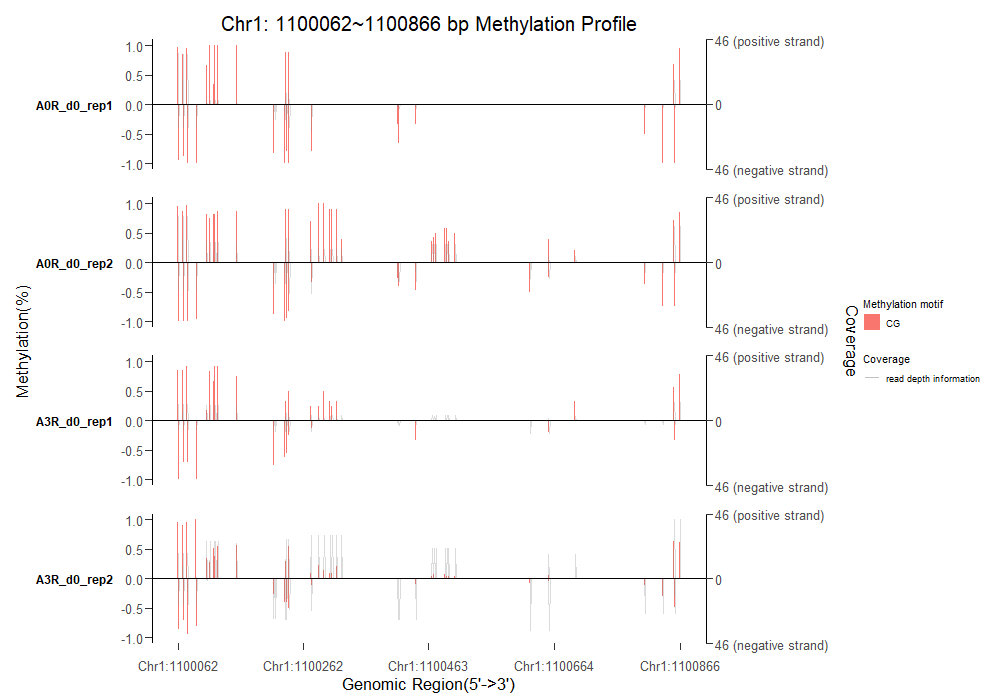
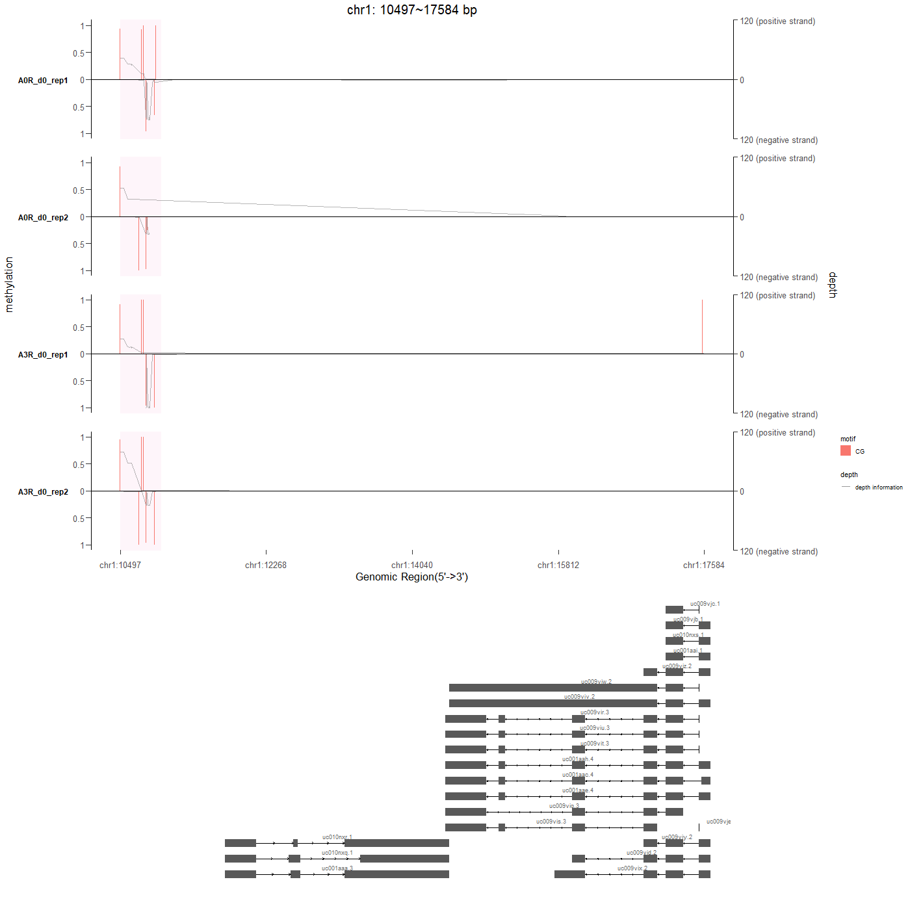

<!-- README.md is generated from README.Rmd. Please edit that file -->

# BMplot: Base Modification Visualization

<!-- badges: start -->
<!-- badges: end -->

This package implements functions to visualize the profile of base
modification in both DNA and RNA.

## Introduction

Epigenetics plays an important role in Biology in the way of changing
genetic information without changing nucleic acids. Histone modification
and Methylation are two vital mechanisms in Epigenetics.

Many methods are used to detect the methylation in Epigenentics with the
combination of sequencing and chemical methods. `Me‑DIP` and `oxBS‑seq`
for `5mC`. `TAB-seq` and `hme‑DIP` for `5hmC`. `6mA‑DIP` and
`6mA‑RE-seq` for `6mA`. These methods can be divided into two
categories, including `Antibody enrichment techniques` for base
fragments and `Single-base resolution techniques` for single base.
BMplot is designed to visualize the `Single-base resolution techniques`.

With the data created by the methods mentioned above, BMplot can map the
data into the sequence data stored in the set of BSgenome packages and
visualize it with great concern to the `strand` and `motif` information.

## Workflow

The BMplot provide two functions to visualize the base modification.
`getBaseModificationDf()` gets the information of base modification in
each base and organizes it into a data frame.
`plotBaseModificationProf()` can return a ggplot object to visualize the
base modification through the data frame created by
`getBaseModificationDf()`.

DNA Methylation is one of the base modifications. It is well worthy to
investigate the different methylation region(dmR) in DNA methylayion.

### Input

Any method can be used to detect dmR and create BSseq object. We use
`DSS` package to achieve this goal. For better experience, We made some
example data for users to go through BMplot.

Since `BSseq` object can only hold methylation value and read depth
value, we create a `bmData` object to store any information of base
modification.

### Get the information of base modification

We extracted the information from BSseq object and mapped to the
sequence data stored in `BSgenome.Athaliana.TAIR.TAIR9`. Then we
extracted the motif and strand information and organized it in the form
of data frame. Cytosine was the interesting base to detect and the
`CG, CHH and CHG` were the motifs to investigate.

``` r
library(BSgenome.Athaliana.TAIR.TAIR9)
BSgenome_thaliana <- BSgenome.Athaliana.TAIR.TAIR9

# A_thaliana_dmR and A_thaliana_BSobj are internal sample data
thaliana_df <- getBaseModificationDf(region = A_thaliana_dmR,
                                     BSgenome = BSgenome_thaliana,
                                     input = A_thaliana_BSobj,
                                     base = "C",
                                     motif = c("CG","CHG","CHH"))
```

The data frame have six columns. `coordinate` stands for the the
coordinate of each base in the region. `motif` stands for the motif of
the methylation. `strand` stands for the strand information of the base
modification. `sample` stands for the sample name of the base
modification sample. `value` stands for the coverage depth of each base
or the methylation value of each base. `type` decides the category
should be depth value or methylation value.

### Visualize the base modification

``` r
plotBaseModificationProf(thaliana_df,switch_y_value = T)
```



## AnnotationAfter plotting the profile of base modification, users can use annotation database to annotate the region of base modification in the form of gene track. Users can input annotation database to `GeneModel` parameter, and then `BMplot` will use `ggbio` to plot the gene track according to `GeneModel` parameter. `GeneModel` can be OrganismDb object, TxDb object, EnsDb object or GrangeList object.

``` r
library(TxDb.Hsapiens.UCSC.hg19.knownGene)
library(BSgenome.Hsapiens.UCSC.hg19)
BSgenome_human <- BSgenome.Hsapiens.UCSC.hg19
txdb <- TxDb.Hsapiens.UCSC.hg19.knownGene

region <- Human_dmR[1,]
region <- region[,c(1:3)]
region[1,c(2,3)] <- c(10000,25000)
human_df <- getBaseModificationDf(region = region,
                                  BSgenome = BSgenome_human,
                                  input = Human_BSobj,
                                  base = "C",
                                  motif = c("CG","CHH","CHG"))

plotBaseModificationProf(human_df,
                         switch_y_value = T,
                         GeneModel = txdb)
```



## Installation

You can install the development version of BMplot from
[GitHub](https://github.com/) with:

``` r
# install.packages("devtools")
devtools::install_github("YuLab-SMU/BMplot")
```
