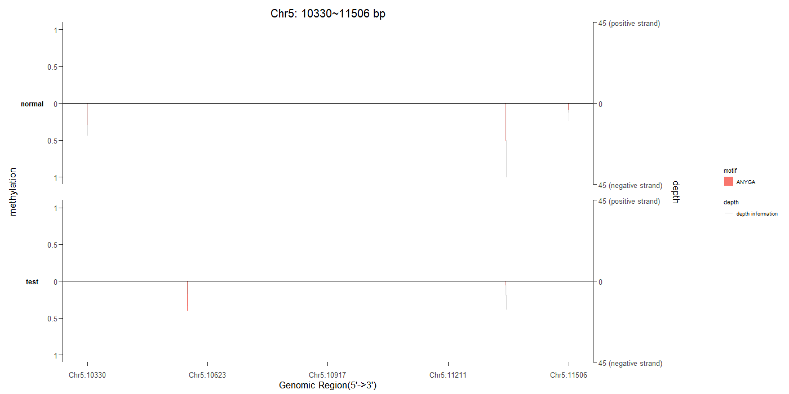
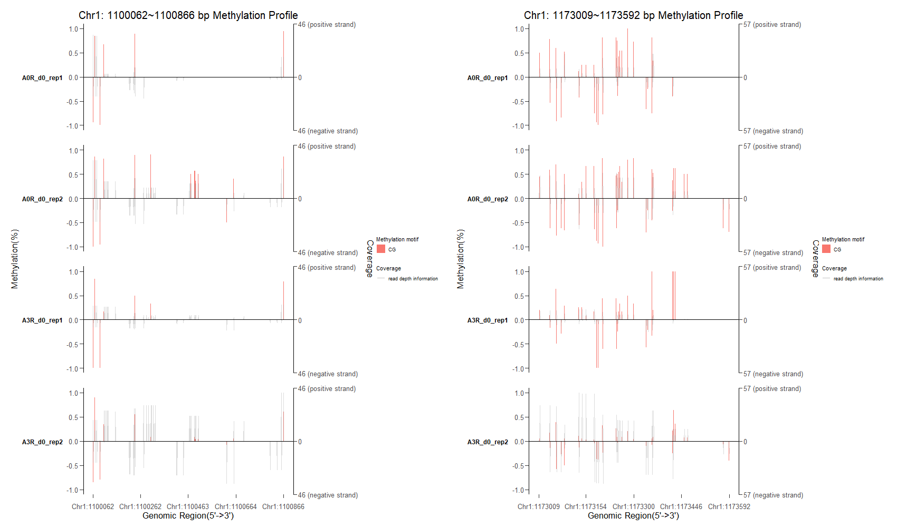
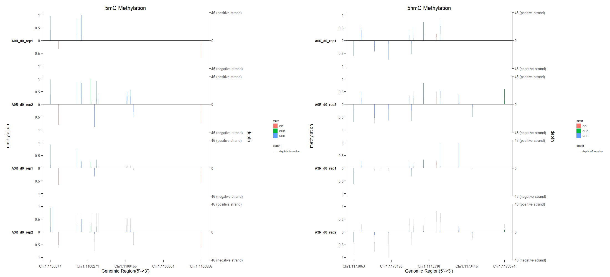

```{r style, echo=FALSE, results='asis', message=FALSE}
knitr::opts_chunk$set(tidy         = FALSE,
                      warning      = FALSE,
                      message      = FALSE)
CRANpkg <- function (pkg) {
    cran <- "https://CRAN.R-project.org/package"
    fmt <- "[%s](%s=%s)"
    sprintf(fmt, pkg, cran, pkg)
}
Biocpkg <- function (pkg) {
    sprintf("[%s](http://bioconductor.org/packages/%s)", pkg, pkg)
}
Biocannopkg <- Biocpkg
```


```{r echo=FALSE, results='hide', message=FALSE}
library(BMplot)
library(BSgenome.Athaliana.TAIR.TAIR9)
library(BSgenome.Hsapiens.UCSC.hg19)
library(ChIPseeker)
library(DSS)
library(ggplot2)
```

# Abstract
`BMplot` is an R package for visualizing Base modification data. Base modification includes DNA methylation and RNA methylation. `BMplot` provides functions to organize the information of base modification and visualize it. 

# Introduction
Epigenetics plays an important role in Biology in the way of changing genetic information without changing nucleic acids. Histone modification and Methylation are two vital mechanisms in Epigenetics. 

Many methods are used to detect the methylation in Epigenentics with the combination of sequencing and chemical methods. `Me‑DIP` and `oxBS‑seq` for `5mC`. `TAB-seq` and `hme‑DIP` for `5hmC`. `6mA‑DIP` and `6mA‑RE-seq` for `6mA`. These methods can be divided into two categories, including `Antibody enrichment techniques` for base fragments and `Single-base resolution techniques` for single base. BMplot is designed to visualize the `Single-base resolution techniques`.
```{r}
## loading package
library(BMplot)
library(BSgenome.Athaliana.TAIR.TAIR9)
library(BSgenome.Hsapiens.UCSC.hg19)
library(ChIPseeker)
library(DSS)
library(ggplot2)
```


# Description
`BMplot` provides functions to achieve the goal of visualizing base modification. `getBaseModificationDf()` can get the information of base modification and organize it into the form of data frame. `plotBaseModificationProf()` use ggplot2 methods to visualize the base modification according to data frame created by `getBaseModificationDf()`. `bmData()` is a constructor for bmData object, which storing any base modification data including methylation value and read coverage value.

## Get the information of base modification

### Input data
The input data contains three main parts. `region` is the region information of base modification organized in the form of data frame. `input` is the data structure which storing base modification data, including `BSseq object` and `bmData object` . `BSgenome` is the sequence information provided by a set of `BSgenome` package.

### BSseq object
`BSseq` is a class defined by `r Biocpkg("bsseq")`[@Kasper_2012], representing whole-genome or capturing bisulfite sequencing data. `BSseq` can be constructed by `bsseq::BSseq()`. It can also be created by `r Biocpkg("DSS")`[@Hao_Wu_2013;@Hao_Wu_2014;@Hao_Wu_2015;@Hao_Wu_2016], using `DSS::makeBSseqData()`. These two constructors above are also exported in BMplot. Other constructors can also be used to construct BSseq object.


### bmData object
bmData object is similar to BSseq object, storing any base modification information, like IPO value[@flusberg2010direct] and so on, for the reason that BSseq object can only store information of methylation and read depth. There are three functions provided by `BMplot` including one constructor and two functions enclosing the constructor.

`bmData()` is the constructor of bmData object. Users can organize the data of interest into matrix-like object. For brief, users should extract each kind of value from the combined results. For example, users may get the combined results in the form of two matrix-like objects. Each object represent one sample and contain two value, like methylation value and depth value. User should first extract the methylation value from each sample and organize all the methylation value into one matrix-like object. Then do the same thing to depth value.
```{r eval=FALSE}
bmData <- function(value1 = NULL, value2 = NULL,
                   pos = NULL, chr = NULL, gr = NULL,
                   sampleNames = NULL, valueNames = NULL,
                   ...)
```


For the sake of convenience, `BMplot` provide two functions encloseing the constructor. Users can use `makebmDataFromData()` to make bmData object from data. The data should be organized in one of the `Granges`, `GrangeList`, `data.frame` and `list` structure. 
```{r eval=FALSE}
# simulated grange and grangelist object
files <- getSampleFiles()

gr1 <- readPeakFile(files[[4]])
mcols(gr1)[[1]] <- runif(length(gr1))

# make bmData from grange object
dmData_grange <- makebmDataFromData(data = gr1, 
                                    sampleNames = c("GSM1295076_CBX6_BF"))


# make bmData from grangelist
gr2 <- readPeakFile(files[[5]])
mcols(gr2)[[1]] <- runif(length(gr2))
gr_list <- GRangesList(gr1,gr2)

dmData_grangelist <- makebmDataFromData(data = gr_list,
                                        sampleNames = c("GSM1295076_CBX6_BF",
                                                        "GSM1295077_CBX7_BF"))

# make bmData from data.frame
df <- data.frame(chr=as.character(seqnames(gr1)),pos=start(gr1),
                 value1= mcols(gr1)[[1]], value2= mcols(gr1)[[2]])

df_bmData <- makebmDataFromData(data = df, 
                                sampleNames = c("GSM1295076_CBX6_BF"))


# make bmData from list
df2 <- data.frame(chr=as.character(seqnames(gr2)),pos=start(gr2),
                  value1= mcols(gr2)[[1]], value2= mcols(gr2)[[2]])

df_list <- list(df,df2)

df_list_bmData <- makebmDataFromData(data = df_list,
                                     sampleNames = c("GSM1295076_CBX6_BF",
                                                     "GSM1295077_CBX7_BF"))
```
Users can also use `makebmDataFromFiles()` to make bmData object from file.
```{r eval=FALSE}

filefolder <- SampleFileFolder()

# test folder with bed files
bed_folder_bmData <- makebmDataFromFiles(name = filefolder[[1]],
                                         sampleNames = c("GSM1295076_CBX6_BF",
                                                         "GSM1295077_CBX7_BF"),
                                         variablesNames = c("IPO_ratio","IPO"))

bedfile <- SamepleBedFiles()
# test bed file
bed_bmData <- makebmDataFromFiles(name = bedfile[[1]],
                                  sampleNames = c("GSM1295076_CBX6_BF"),
                                  variablesNames = c("IPO_ratio","IPO"))


# test folder with txt files
txt_folder_bmData <- makebmDataFromFiles(name = filefolder[[2]],
                                         sampleNames = c("GSM1295076_CBX6_BF",
                                                         "GSM1295077_CBX7_BF"),
                                         variablesNames = c("IPO_ratio","IPO"))


txt_file <- SamepleTxtFiles()
# test txt file
txt_bmData <- makebmDataFromFiles(name = txt_file[[1]],
                                  sampleNames = c("GSM1295076_CBX6_BF"),
                                  variablesNames = c("IPO_ratio","IPO"))

```


## Plot base modification
The main part of the input data of `plotBaseModificationProf()` is the data frame created by `getBaseModificationDf()`.The output data of is a ggplot object.


# Work Flow
DNA Methylation is one of the base modifications. It is well worthy to investigate the different methylation region(dmR) in DNA methylayion. We downloaded data from GEO(GSE52140)[@hascher2014dna] and organized the data in to `Human_BSobj.rda` and `Human_dmR.rda`. The procession script was put in `./data-raw/Human_data_procession.R`. We use the visualization of different methylation region in Homo sapiens to describe the work flow.

## Detect dmR and Create BSseq object
We use `r Biocpkg("DSS")`[@Hao_Wu_2013;@Hao_Wu_2014;@Hao_Wu_2015;@Hao_Wu_2016] to detect dmR and create BSseq object.

## Get the information of base modification
We extracted the information from BSseq object and mapped to the sequence data stored in `BSgenome.Hsapiens.UCSC.hg19`. Then we extracted the motif and strand information and organized it in the form of data frame. Cytosine was the interesting base to detect and the `CG, CHH and CHG` were the motifs to investigate.
```{r }
library(BSgenome.Hsapiens.UCSC.hg19)
BSgenome_human <- BSgenome.Hsapiens.UCSC.hg19
human_df <- getBaseModificationDf(region = Human_dmR[1,],
                                  BSgenome = BSgenome_human,
                                  input = Human_BSobj,
                                  base = "C",
                                  motif = c("CG"))

head(human_df)
```
The data frame have six columns. `coordinate` stands for the the coordinate of each base in the region. `motif` stands for the motif of the methylation. `strand` stands for the strand information of the base modification. `sample` stands for the sample name of the base modification sample. `value` stands for the coverage depth of each base or the methylation value of each base. `type` decides the category should be depth value or methylation value.


## Visualize the base modification
```{r fig.cap="Visualize dmR in Homo sapiens",fig.align='center', fig.height=7, fig.width=12}
plotBaseModificationProf(human_df)
```


# Examples

## Visualize Different Methylation Region in Arabidopsis thaliana
We downloaded data from GEO(GSE62206) and organized the data in to `A_thaliana_BSobj.rda` and `A_thaliana_dmR.rda`. The procession script was put in `./data-raw/A_thaliana_data_procession.R`.

### Get the information of base modification
We use the same procession above to get the base modification of A_thaliana. The only difference is that we can get multiple motifs rather than just one motif above.
```{r}
library(BSgenome.Athaliana.TAIR.TAIR9)
BSgenome_thaliana <- BSgenome.Athaliana.TAIR.TAIR9
thaliana_df <- getBaseModificationDf(region = A_thaliana_dmR,
                                     BSgenome = BSgenome_thaliana,
                                     input = A_thaliana_BSobj,
                                     base = "C",
                                     motif = c("CG","CHG","CHH"))

head(thaliana_df)
```

### Visualize the base modification
```{r fig.cap="Visualize dmR in A_thaliana",fig.align='center', fig.height=7, fig.width=12}
plotBaseModificationProf(thaliana_df)
```

### Change the colors of each motif
The colors we use to visualize motif are the default colors in `r CRANpkg("ggplot2")`[@Hadley_2016]. Users can specify the colors of interest through `motif_color`. The order of color maps the order of the motifs on the picture.
```{r fig.cap="change the colors of motif",fig.align='center', fig.height=7, fig.width=12}
plotBaseModificationProf(thaliana_df,
                         motif_color = c("#993366","#3300CC","#CC6600"))
```

## Visualize special motif with position bias
Normal motifs, like `CG` and `CHG`, have the base in the first position. However, we would visualize others special motifs in the research of Epigenetics. We would investigate adenine in `GAGG`, which having the interesting base in the second position. `position_bias` comes to solve this problem. 
BMplot provide simulated data to illustrate this parameter. We simulated the base modification data of adenine and put the procession in the `./data-raw/simulated_A_thaliana_data_procession.R`.
```{r eval=FALSE}
df_simulate <- getBaseModificationDf(region = simulated_dmR,
                                     input = simulated_BSobj,
                                     BSgenome = BSgenome_thaliana,
                                     motif = c("GAGG","ANYGA"),
                                     position_bias = c(2,5),
                                     base = "A")

plotBaseModificationProf(df_simulate)
```

The picture above visualized the interesting motif, `ANYGA`. Users can visualize any motifs of interests through `position_bias`.

## Visualize a list of dmRs
BMplot supports to visualize a list of dmRs.
```{r eval=FALSE}
df_list <- getBaseModificationDf(region = Human_dmR[1:2,],
                                 BSgenome = BSgenome_human,
                                 input = Human_BSobj,
                                 base = "C",
                                 motif = c("CG"))

## nrow control the layout of pictures
plotBaseModificationProf(df_list,nrow = 1)
```

### Visualize two kinds of base modifications in a picture
There are many kinds of base modifications. For example, the `5mC` and `5hmC` in cytosine modification and the `6mA` in adenine modification. Hence, there is a potential need to visualize two kinds of modifications in one picture. Functions in BMplot meet this need. 
We use two sets of data focusing in `5mC` and assume that one is data for `5mC` and the other is for `5hmC`. The method to visualize two kinds of base modification is to assign different titles to different pictures.
```{r eval=FALSE}

df_list1 <- getBaseModificationDf(region = Human_dmR[1:2,],
                                  BSgenome = BSgenome_human,
                                  input = Human_BSobj,
                                  base = "C",
                                  motif = c("CG"))

plotBaseModificationProf(df_list1,
                         title = c("5mC Methylation","5hmC Methylation"),
                         nrow = 1)

```


# Common problems
## The order of the motifs
The `motif` parameter has its own order. `getBaseModificationDf()` will do the annotation in the order of `motif`.
```{r eval=FALSE}
df1 <- getBaseModificationDf(region = Human_dmR[1,],
                             BSgenome = BSgenome_human,
                             input = Human_BSobj,
                             base = "C",
                             motif = c("CN","CH"))
```
If the motifs are specified above, the `CH(H->A/T/C)` will cover some parts of `CN(N->A/T/G/C)`. The result will have two parts, `CH` and `CN`, which is out of expectation for the reason that `N` contains `H`. In a word, Users should be aware of the order of the `motif`.

# References


